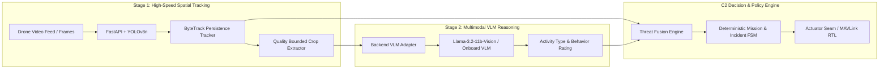

# VanRakshak (वनरक्षक) — Technical Architecture Specification

## 1. System Architecture & Dual-Tier Perception Loop

VanRakshak operates on a **2-Stage Edge-to-Decision Architecture** designed for autonomous UAV deployment in bandwidth-constrained forest environments. Spatial tracking (high FPS, low latency) is decoupled from semantic scene understanding (event-driven VLM reasoning).

---

## 2. Core Subsystems

### A. Edge Perception & Tracking (`backend/app/perception.py`)
- **Detector**: YOLOv8n / RT-DETR object detector producing normalized bounding boxes for persons, vehicles, elephants, and wildlife.
- **Tracker**: ByteTrack persistence tracker maintaining stable track IDs across frames and re-identifying lost tracks during occlusions.
- **Evidence Extractor**: Selects highest-confidence, bounded image crops for persistent tracks to minimize telematics bandwidth (>98% savings over streaming raw video).

### B. Multimodal VLM Verification (`backend/app/vlm.py`, `backend/app/services.py`)
- Asynchronously queries vision-language models (e.g. `meta/llama-3.2-11b-vision-instruct` or local onboard models like Moondream2) using bounded crop artifacts.
- Extracts structured semantic output: `activity_type` (`POACHING_SUSPECT`, `FIRE_HAZARD`, `SAFE_WILDLIFE`), `behavior_rating`, and numeric `vlm_confidence`.
- Built-in circuit breakers: automatically falls back to spatial persistence tracking if the VLM encounters timeouts or API failures.

### C. Deterministic Safety Policy Engine (`backend/app/policies.py`)
- Evaluates independent domain policies with strict rules:
  - **Human Intrusion Policy**: Requires both track persistence and confidence/verification before raising sirens.
  - **Wildlife Conservation Policy**: Strict constraint — elephants, rhinos, and fauna trigger silent tracking and ranger dispatch; acoustic sirens are never emitted.
  - **Thermal & Wildfire Policy**: Triggers fire hazard state, emergency dispatch, and autonomous fire suppressant release.

### D. Mission State Machine & Telemetry (`backend/app/state_machines.py`, `backend/app/replay.py`)
- **Mission States**: `PATROL` $\rightarrow$ `INVESTIGATE` $\rightarrow$ `TRACK` $\rightarrow$ `VERIFY` $\rightarrow$ `ALERT` $\rightarrow$ `RETURN_HOME`.
- **Fail-Safe Overrides**: Low battery (<25%) and geofence boundary breaches immediately override active missions to trigger `RETURN_TO_BASE`.

### E. Actuator & Autopilot Seam (`backend/app/actuator.py`, `backend/app/hardware.py`)
- Emits idempotent, timestamped command events (`SIREN_ACTIVATE`, `SPOTLIGHT_ON`, `FIRE_SUPPRESSANT_DEPLOY`, `DISPATCH_RANGER`, `RETURN_TO_BASE`).
- Bridges commands to **MAVLink / ArduPilot SITL** for physical autonomous flight behavior (Return-to-Launch, Loiter).

---

## 3. Technical Comparison

| Metric / Capability | Generic Cloud Vision LLM API | Standard AI Drone (Basic YOLO) | **VanRakshak C2 Robotics Stack** |
| :--- | :--- | :--- | :--- |
| **Input Modalities** | Static image prompt only | Frame-by-frame visual stream | **Video + ByteTrack Vectors + Sensor Telemetry + GPS Geofence** |
| **Temporal Context** | None (single static frame) | None (per-frame bounding box) | **Multi-frame trajectory tracking & persistence** |
| **Perception Latency** | High (1.5s – 4.0s) | Low (15ms – 33ms) | **Dual-Tier: 15ms Edge Tracking + Asynchronous VLM Verification** |
| **Bandwidth Demand** | 100% full frame uploads | 100% video streaming | **>98% bandwidth reduction via event-driven crop evidence** |
| **Decision Authority** | Unconstrained LLM text | Fixed box counting | **Deterministic Safety Rules + Finite State Machine** |
| **Actuator & Autopilot** | None | None | **Idempotent MAVLink command lifecycle with ACK tracking** |
| **Fail-Safe Robustness** | Fails if network drops | Raw bounding boxes | **Automatic fallback to spatial persistence engine** |
