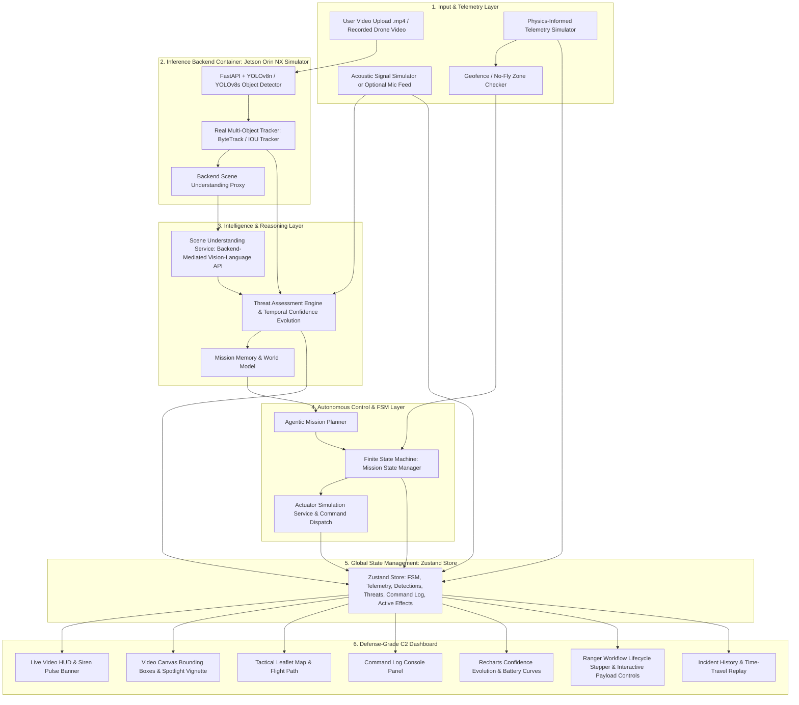
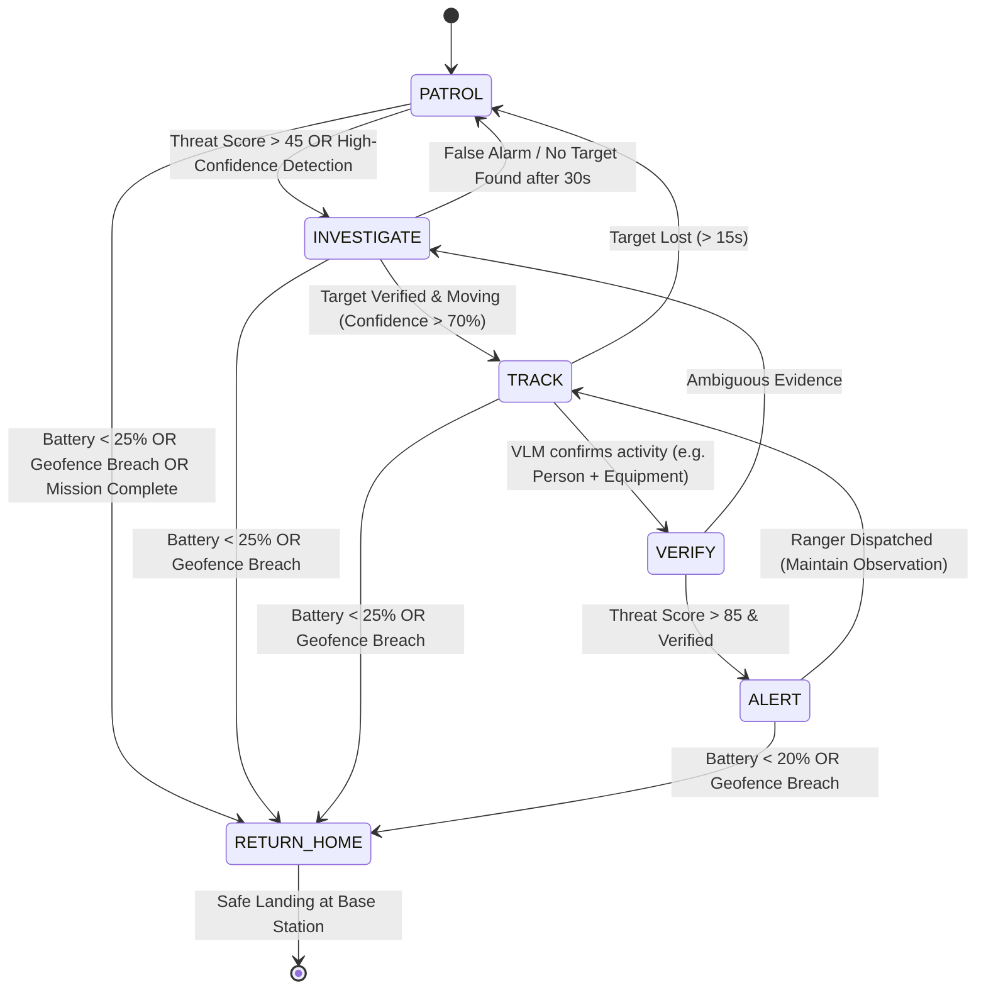

# Implementation Plan — VanRakshak Autonomous AI Drone Control Center & Perception Platform MVP

**Role Perspective**: Senior Robotics Engineer, Autonomous Systems Architect, and AI Platform Engineer  
**Core Directive**: Build the **"Brain"** of VanRakshak — a production-ready, modular software platform and defense-grade Command & Control (C2) Dashboard with real computer vision detection, multi-object tracking, real VLM scene understanding, Zustand state orchestration, and an Actuator Command Feedback Layer.

> [!SECURITY]
> **VLM API keys must remain server-only**. Frontend components/services never call external VLM providers directly. The frontend calls backend-owned endpoints, and backend owns provider credentials, retries, validation, and fallbacks.

> [!IMPORTANT]
> **Operational Disclaimer**:
> **Detection and tracking run on real uploaded footage using a real pretrained model. Telemetry (battery, GPS, wind) is software-simulated since no physical drone is available. There is no live drone/MAVLink connection.**
>
> *Out of Scope for Prototype Phase*: Physical drone hardware execution, physical fire suppressant payload release mechanisms, multi-drone mesh relay networks, and Beyond Visual Line of Sight (BVLOS) regulatory clearance.

---

## 1. System Architecture & Layered AI Pipeline

The software pipeline strictly decouples real video frame processing, tracking, VLM semantic reasoning, threat scoring, state planning, actuator command feedback, and user interface state management.



---

## 2. Finite State Machine (FSM) Design

The autonomous drone operates on a deterministic Finite State Machine (`MissionFSM`). State transitions are dictated by threat scores, battery levels, target confidence, and geofence boundary checks.

All transition thresholds are parameterized in `RULE_ENGINE_CONFIG.fsmThresholds`; no hardcoded transition constants are allowed in service code.



### State Definitions & Behavior Matrix

| Mission State | Primary Objective | Camera/Payload Action | Flight Behavior | FSM Trigger to Next State |
| :--- | :--- | :--- | :--- | :--- |
| `PATROL` | Cover predefined search grid | Standard 45° downward angle, Siren Off | Constant airspeed (10-12 m/s), lawnmower pattern | Anomaly detected ($\text{Threat Score} > 45$) |
| `INVESTIGATE` | Inspect region of interest | Zoom RGB + Thermal + Spotlight On, Siren Off | Descend to 40m, slow speed (4 m/s) | Object identified or timeout (30s) |
| `TRACK` | Maintain line of sight on target | Lock gimbal on `track_id`, Spotlight On, Siren Off | Orbit target radius (30m circle) | Target verified or visual loss (> 15s) |
| `VERIFY` | VLM semantic confirmation | Multi-angle snapshot capture, Spotlight On, Siren Off | Hold position (Hovering) | VLM confidence threshold reached |
| `ALERT` | Broadcast emergency dispatch | Stream high-res video feed + Spotlight On + Siren Activate | High-altitude hover (60m) + Emergency Broadcast | Ranger acknowledged / Low battery |
| `RETURN_HOME` | Safe extraction to base | Stow payloads, Spotlight Off, Siren Off | Direct line to home base | Touchdown at base / Geofence breach |

---

## 3. Master Configurations & Rule Engine Constants (`config/ruleEngineConfig.js`)

All engine coefficients, FSM thresholds, and zone definitions are centralized in a single configuration file:

```javascript
// src/config/ruleEngineConfig.js
export const RULE_ENGINE_CONFIG = {
  // Threat Score Formula Weights (w1 + w2 + w3 + w4 = 1.0)
  weights: {
    w1_vlmConfidence: 0.35,
    w2_detectorConfidence: 0.25,
    w3_zoneRisk: 0.25,
    w4_acousticScore: 0.15
  },

  // Temporal Confidence Evolution Parameters
  confidenceEvolution: {
    alpha_gain: 0.15,      // Rate of confidence increase on confirming frame
    beta_decay: 0.05,      // Rate of confidence decay per frame when target obscured
    max_confidence: 0.99,
    min_confidence: 0.00
  },

  // Physics-Based Telemetry Battery Model Coefficients
  batteryModel: {
    c1_speedSq: 0.02,      // Power drain scaling with speed squared (v^2)
    c2_payloadKg: 1.5,     // Power drain scaling with payload weight
    c3_windSq: 0.015,      // Power drain scaling with wind speed squared (w^2)
    base_hover_drain: 0.05 // Base battery drain per second while hovering
  },

  // FSM State Transition Thresholds
  fsmThresholds: {
    investigateThreatScore: 45.0,
    alertThreatScore: 85.0,
    highConfidenceDetection: 0.70,
    verifyVlmConfidence: 0.75,
    returnHomeBatteryPct: 25.0,
    criticalBatteryPct: 20.0,
    investigateTimeoutSec: 30,
    trackLossTimeoutSec: 15,
    ambiguousEvidenceFallbackSec: 20
  },

  // Acoustic Signal Configuration (Simulated by default for MVP)
  acoustic: {
    sourceMode: "SIMULATED", // SIMULATED | LIVE_MIC
    fallbackScore: 0.30,
    smoothingAlpha: 0.20,
    maxScore: 1.0,
    minScore: 0.0
  },

  // Geofence Protected Zones & Risk Mapping
  protectedZones: [
    {
      id: "ZONE_A_CORE_CORRIDOR",
      name: "Core Wildlife Corridor",
      riskMultiplier: 1.0,
      polygon: [
        { lat: 13.0820, lng: 80.2700 },
        { lat: 13.0850, lng: 80.2700 },
        { lat: 13.0850, lng: 80.2740 },
        { lat: 13.0820, lng: 80.2740 }
      ]
    },
    {
      id: "ZONE_B_BUFFER",
      name: "Buffer Reserve Area",
      riskMultiplier: 0.6,
      polygon: [
        { lat: 13.0800, lng: 80.2680 },
        { lat: 13.0870, lng: 80.2680 },
        { lat: 13.0870, lng: 80.2760 },
        { lat: 13.0800, lng: 80.2760 }
      ]
    }
  ],

  // Geofence No-Fly Perimeter Bounds
  geofenceBoundary: {
    minLat: 13.0750,
    maxLat: 13.0900,
    minLng: 80.2600,
    maxLng: 80.2850
  }
};
```

---

## 4. Services Architecture & Detailed Specifications

### A. FastAPI Detection & Tracking Backend (`backend/`)
- **FastAPI Endpoint**: Accepts video frames or mp4 stream.
- **YOLOv8 Detector (`detector.py`)**: Runs `ultralytics` YOLOv8n/s using stock COCO classes (`person`, `car`, `truck`, `motorcycle`, etc.).
- **ByteTrack Tracker (`tracker.py`)**: Assigns persistent tracking IDs (`track_id`) across frames to ensure genuine motion tracking.
- **Framing**: Simulates the Jetson Orin NX onboard inference container.

### B. VLM Scene Understanding Service (`SceneUnderstandingService.js`)
Sends base64 cropped detection frames to a **backend-owned** scene endpoint (for example, `POST /scene-understanding`), which then calls a real VLM API (e.g. Anthropic Claude API) using a structured prompt:

```text
System Prompt: You are VanRakshak AI, an autonomous forest surveillance intelligence engine. Analyze the provided image snippet cropped from a drone camera feed. Return ONLY valid JSON with keys:
{
  "scene_summary": "<1-sentence description of observed activity>",
  "activity_type": "<ILLEGAL_LOGGING | POACHING_SUSPECT | UNAUTHORIZED_VEHICLE | FIRE_HAZARD | SAFE_WILDLIFE>",
  "behavior_rating": "<LOW | MEDIUM | HIGH | CRITICAL>",
  "vlm_confidence": <number 0.0 - 1.0>
}
```

*Fallback Mechanism*: If the VLM API call fails or is rate-limited, backend returns a rule-based summary (e.g., `"Person detected (Fallback Mode - VLM Unreachable)"`) with $C_{\text{vlm}} = 0.50$ and `reason: "VLM_UNREACHABLE"`.

*Security Constraint*: Provider API keys are loaded only in backend runtime environment variables; keys are never shipped to browser bundles, logs, or frontend config.

### C. Threat Assessment Engine & Confidence Evolution
- **Confidence Evolution**: Incremental update per frame:
  $$C_t = \min\left(0.99, \max\left(0.0, C_{t-1} + \alpha \cdot \text{det\_conf} - \beta \cdot \text{decay}\right)\right)$$
- **Threat Score Formula**:
  $$\text{ThreatScore} = (w_1 \cdot C_{\text{vlm}} + w_2 \cdot C_t + w_3 \cdot \text{ZoneRisk} + w_4 \cdot \text{AcousticScore}) \times 100$$
  > [!NOTE]
  > **Scale Clarification**: `ThreatScore` is scaled to $0-100$ via the $\times 100$ multiplier for intuitive display in the C2 Dashboard, while `vlm_confidence`, `det_conf`, and `confidence_evolution` values remain strictly on a $0.0-1.0$ scale throughout internal processing.
- Evaluates scores against `ruleEngineConfig.js` thresholds to trigger FSM transitions.

### D. Acoustic Signal Service (`AcousticSignalService.js`)
- Provides `acoustic_score` on a strict `0.0-1.0` scale.
- MVP default mode is software simulation with deterministic noise patterns and optional event bursts (vehicle, chainsaw-like, silence) for scenario playback.
- Optional mode accepts a live mic feed if available, but this is not required for MVP acceptance.
- If source data is unavailable, uses `acoustic.fallbackScore` and sets `acoustic_source = "FALLBACK"` for observability.

### E. Agentic Mission Planner & FSM Controller
- Evaluates telemetry, threat score, battery level, and geofence boundary per tick.
- If GPS coordinates violate `geofenceBoundary`, immediately forces `RETURN_HOME` state with alert log: `"GEOFENCE_BREACH_SECURITY_OVERRIDE"`.

### F. Mission Memory & World Model (`MissionMemoryService.js`)
- Maintains short-lived mission context (`recentTrackHistory`, `lastVerifiedThreat`, `zoneEntryHistory`, `lastDispatchState`) used by planner decisions.
- Explicitly bounded in memory and resettable between incident runs.

### G. Ranger Dispatch Workflow Stepper
Manages the end-to-end lifecycle in the UI:
$$\text{Threat Detected} \longrightarrow \text{Nearest Ranger Identified} \longrightarrow \text{Dispatch Sent} \longrightarrow \text{Accepted} \longrightarrow \text{En Route} \longrightarrow \text{Arrived} \longrightarrow \text{Resolved}$$

---

## 5. System Data Schemas (JSON Contracts)

```json
{
  "telemetry": {
    "timestamp": 1784739200,
    "drone_id": "VANRAKSHAK_ORIN_NX_01",
    "battery_pct": 78.4,
    "voltage": 22.8,
    "altitude_m": 65.0,
    "speed_mps": 9.2,
    "wind_speed_kmh": 12.5,
    "gps": { "lat": 13.0827, "lng": 80.2707 },
    "fsm_state": "TRACK",
    "est_remaining_flight_sec": 1420
  },
  "tracked_objects": [
    {
      "track_id": "TRK_042",
      "class_name": "person",
      "confidence": 0.945,
      "bbox": [240, 180, 80, 160],
      "gps": { "lat": 13.0831, "lng": 80.2712 },
      "history_len": 48
    }
  ],
  "scene_understanding": {
    "scene_summary": "Person walking near protected timber boundary.",
    "activity_type": "POACHING_SUSPECT",
    "behavior_rating": "HIGH",
    "vlm_confidence": 0.88
  },
  "acoustic_signal": {
    "acoustic_score": 0.34,
    "acoustic_source": "SIMULATED",
    "event_hint": "LOW_ENGINE_NOISE"
  },
  "threat_event": {
    "event_id": "EVT_20260722_009",
    "threat_level": "CRITICAL",
    "threat_score": 94.5,
    "category": "Illegal Entry / Poaching",
    "confidence_evolution": [0.45, 0.68, 0.82, 0.945],
    "gps": { "lat": 13.0831, "lng": 80.2712 }
  },
  "actuator_command": {
    "command_id": "CMD_0042_891",
    "action": "SIREN_ACTIVATE",
    "triggered_by_state": "ALERT",
    "status": "ACKNOWLEDGED",
    "sent_at": 1784739200100,
    "ack_at": 1784739200412,
    "params": { "targetState": "ALERT_WARNING", "volumePct": 100 }
  },
  "ranger_dispatch": {
    "dispatch_id": "DISP_881",
    "assigned_team": "Ranger Unit 3 (Saveetha North Outpost)",
    "distance_km": 1.4,
    "eta_minutes": 3.5,
    "workflow_status": "EN_ROUTE",
    "timeline": [
      { "status": "THREAT_DETECTED", "time": "21:30:00" },
      { "status": "DISPATCH_SENT", "time": "21:30:15" },
      { "status": "ACCEPTED", "time": "21:30:40" },
      { "status": "EN_ROUTE", "time": "21:31:05" }
    ]
  }
}
```

---

## 6. Software Architecture & File Layout

```text
vanrakshak-c2-platform/
├── backend/
│   ├── main.py                  # FastAPI app & frame processing endpoints
│   ├── detector.py               # YOLOv8 (ultralytics) inference container wrapper
│   ├── tracker.py                 # ByteTrack / IOU tracker implementation
│   ├── scene_understanding_proxy.py # Backend VLM provider adapter (server-side keys only)
│   └── requirements.txt         # fastapi, uvicorn, ultralytics, opencv-python, numpy
├── package.json
├── index.html
├── vite.config.js
├── tailwind.config.js
├── src/
│   ├── config/
│   │   └── ruleEngineConfig.js   # Central weights, FSM thresholds, zones, battery params
│   ├── store/
│   │   └── useVanRakshakStore.js # Zustand store: FSM, Telemetry, Detections, Threats, Command Log, Active Effects
│   ├── services/
│   │   ├── TelemetryService.js   # Physics battery model & GPS movement generator
│   │   ├── VisionService.js       # Client HTTP/WS bridge to FastAPI YOLO backend
│   │   ├── SceneUnderstandingService.js # Calls backend scene endpoint; no provider key in frontend
│   │   ├── AcousticSignalService.js     # Simulated acoustic score and optional live mic adapter
│   │   ├── ThreatAssessmentService.js   # Score calculation & confidence evolution
│   │   ├── MissionPlannerService.js     # FSM controller & geofence safety guards
│   │   ├── MissionMemoryService.js      # Short-lived world model and incident memory
│   │   ├── ActuatorSimulationService.js # FSM command translator & ACK simulator
│   │   ├── RangerWorkflowService.js     # Dispatch lifecycle manager
│   │   ├── CoverageAnalyticsService.js  # Patrol grid heatmap generator
│   │   └── ReplayService.js             # Time-travel recording & scrubbing
│   ├── components/
│   │   ├── HeaderTelemetryHUD.jsx # Top bar telemetry + FSM state pill + Siren audio/visual banner
│   │   ├── VideoPerceptionCanvas.jsx # MP4 player + bounding boxes + VLM overlay + Spotlight vignette
│   │   ├── TacticalMap.jsx        # Leaflet map, flight path, geofence polygon, incident pins
│   │   ├── FSMStateIndicator.jsx  # Interactive FSM state machine status view
│   │   ├── CommandLogPanel.jsx    # Scrolling console-style actuator command log
│   │   ├── ThreatStreamPanel.jsx  # Detection stream & Recharts confidence evolution graph
│   │   ├── RangerDispatchModal.jsx# High-priority alert popup, workflow stepper & Payload controls
│   │   ├── CoverageHeatmapView.jsx# Grid coverage analytics view
│   │   └── IncidentReplayTimeline.jsx # Historical scrub bar
│   ├── data/
│   │   └── demoScenarios.js       # Pre-configured demo coordinates & video links
│   ├── App.jsx                    # Master Command & Control Dashboard
│   └── index.css                  # Defense-grade styling & glassmorphism theme
└── public/
    └── assets/                    # Sample video clips, siren audio (.mp3), and icons
```

---

## 7. Verification & End-to-End Pipeline Validation Plan

### Automated Build & Syntax Checks
1. **Backend Verification**: Run `uvicorn main:app --reload` inside `backend/` and verify `/health` and `/detect` endpoints return 200 OK with valid JSON bounding boxes.
2. **Backend Scene Proxy Verification**: Verify `POST /scene-understanding` returns valid JSON contract and no provider secret appears in response payload or logs.
3. **Frontend Build Verification**: Run `npm run build` to ensure zero compilation or JSX errors.

### Automated Quality Gates (Required Before Demo Sign-Off)
1. Unit tests for:
  - threat scoring math including acoustic fallback path
  - confidence evolution update bounds and decay behavior
  - FSM transition guards using only config thresholds
2. Integration tests for:
  - `/detect` endpoint returning tracked objects
  - `/scene-understanding` endpoint fallback behavior on forced VLM failure
3. UI integration tests for:
  - command log ACK progression (`SENT` -> `ACKNOWLEDGED`)
  - siren activation/deactivation based on `activeEffects`

### End-to-End Execution Pipeline Verification
1. **Video Upload & Real Detection**: Upload a test drone `.mp4` video containing a person walking into frame $\rightarrow$ Confirm FastAPI YOLO backend returns real bounding box coordinates at `p95 <= 250ms` in local dev profile $\rightarrow$ Confirm canvas overlay draws `person` box.
2. **Real VLM Call & Fallback**: Confirm cropped detection frame triggers API call to VLM $\rightarrow$ Confirm `scene_summary` populates with real text $\rightarrow$ Test network disconnect to verify fallback mode activates gracefully.
3. **End-to-End Threat & FSM Transition**:
   - Confirm threat score computes from `ruleEngineConfig.js` formula ($w_1, w_2, w_3, w_4$).
  - Confirm `acoustic_score` is present and bounded in `0.0-1.0` (or fallback value when source unavailable).
   - Confirm when threat score exceeds 45, FSM transitions `PATROL` $\rightarrow$ `INVESTIGATE`.
   - Confirm when threat score exceeds 85, FSM transitions `VERIFY` $\rightarrow$ `ALERT` and opens Ranger Dispatch Modal.
4. **Actuator Command Feedback & Siren Deactivation Check**:
   - Trigger FSM transition into `ALERT` $\rightarrow$ Confirm `CommandLogPanel` shows `SIREN_ACTIVATE` go from `SENT` to `ACKNOWLEDGED` within ~400ms $\rightarrow$ Confirm HUD red pulse + siren audio plays.
   - Transition FSM from `ALERT` to `TRACK` or `RETURN_HOME` $\rightarrow$ Confirm `SIREN_DEACTIVATE` is dispatched and acknowledged $\rightarrow$ Confirm HUD red pulse stops and siren audio silences immediately.
   - Click the interactive **Fire Suppression** button $\rightarrow$ Confirm `CommandLogPanel` immediately logs `FIRE_SUPPRESSANT_DEPLOY ... UNAVAILABLE — HARDWARE NOT INSTALLED (Phase 2)` in real time.
5. **Geofence Security Override**: Force simulated drone GPS outside `geofenceBoundary` $\rightarrow$ Confirm FSM immediately forces `RETURN_HOME`.
6. **Ranger Workflow Stepper**: Click `Dispatch Ranger` $\rightarrow$ Confirm status transitions (`SENT` $\rightarrow$ `ACCEPTED` $\rightarrow$ `EN_ROUTE` $\rightarrow$ `ARRIVED` $\rightarrow$ `RESOLVED`).
7. **Time-Travel Replay**: Drag replay slider $\rightarrow$ Verify map position, telemetry values, and canvas bounding boxes rewind to exact timestamp.

---

## 8. Actuator Simulation & Command Feedback Layer

The **Actuator Simulation & Command Feedback Layer** bridges autonomous decision-making (`MissionFSM`) with hardware command execution semantics, ensuring that physical intents are visibly declared, logged, and tracked with acknowledgement feedback rather than silently skipped.

### A. Service Responsibilities (`src/services/ActuatorSimulationService.js`)
Translates state changes from the `MissionFSM` into explicit hardware command payloads.

#### FSM State to Actuator Action Mapping (Fixed Siren Deactivation Logic)

```javascript
// Actuator Command Matrix
const FSM_ACTUATOR_MAP = {
  PATROL: [
    { action: "GIMBAL_LOCK", params: { targetState: "FREE_SCAN" } },
    { action: "SPOTLIGHT_OFF" },
    { action: "SIREN_DEACTIVATE" } // Ensures siren turns off when exiting ALERT
  ],
  INVESTIGATE: [
    { action: "GIMBAL_LOCK", params: { targetState: "TARGET_TRACK" } },
    { action: "SPOTLIGHT_ON" },
    { action: "SIREN_DEACTIVATE" }
  ],
  TRACK: [
    { action: "SPOTLIGHT_ON" },
    { action: "SIREN_DEACTIVATE" } // Deactivates siren when transitioning ALERT -> TRACK
  ],
  VERIFY: [
    { action: "GIMBAL_LOCK", params: { targetState: "HOLD_AND_CAPTURE" } },
    { action: "SPOTLIGHT_ON" },
    { action: "SIREN_DEACTIVATE" }
  ],
  ALERT: [
    { action: "SIREN_ACTIVATE" },
    { action: "SPOTLIGHT_ON" }
  ],
  RETURN_HOME: [
    { action: "SPOTLIGHT_OFF" },
    { action: "SIREN_DEACTIVATE" },
    { action: "PAYLOAD_STOW" }
  ]
};
```

#### Collision-Free Command Object Schema & ACK Lifecycle
When an FSM transition occurs or an interactive button is clicked, `ActuatorSimulationService` executes the following sequence:

1. **Construct Collision-Free Command Object**:
   ```javascript
   let commandCounter = 0; // Incremental counter prevents collision on same-ms ticks
   
   const createCommand = (action, triggeredByState, params = {}) => ({
     command_id: `CMD_${Date.now()}_${++commandCounter}`,
     action,
     triggered_by_state: triggeredByState,
     status: "SENT",
     sent_at: Date.now(),
     ack_at: null,
     params
   });
   ```
2. **Push to Store**: Append immediately to `commandLog` in Zustand store.
3. **Simulate Hardware Acknowledgement (ACK)**:
   - For standard actions (`SIREN_ACTIVATE`, `SIREN_DEACTIVATE`, `SPOTLIGHT_ON`, `SPOTLIGHT_OFF`, `PAYLOAD_STOW`, `GIMBAL_LOCK`), schedule a random 200–400ms delay, then update status to `"ACKNOWLEDGED"`, update `activeEffects` state, and populate `ack_at`.
   - **Special Interactive Rule for Fire Suppressant**: When `FIRE_SUPPRESSANT_DEPLOY` is triggered (via manual UI click), it immediately resolves to `status: "UNAVAILABLE — HARDWARE NOT INSTALLED (Phase 2)"` with `ack_at: null`.

### B. Command Log Console Panel (`src/components/CommandLogPanel.jsx`)
A scrolling, timestamped console-style log component styled with glassmorphism defense-grade UI:
- Subscribes to the `commandLog` array in Zustand.
- Automatically auto-scrolls to the newest command entry.
- Renders status indicators per line:
  - 🟡 **Yellow Dot**: `SENT` (In-flight to flight controller)
  - 🟢 **Green Dot**: `ACKNOWLEDGED` (Confirmed executed by hardware)
  - 🔴/🔘 **Grey/Red Dot**: `UNAVAILABLE — HARDWARE NOT INSTALLED (Phase 2)`

```text
[21:30:41] ALERT → SIREN_ACTIVATE ......... SENT
[21:30:41] ALERT → SIREN_ACTIVATE ......... ACKNOWLEDGED (312ms)
[21:31:10] TRACK → SIREN_DEACTIVATE ........ ACKNOWLEDGED (210ms)
[21:31:12] RETURN_HOME → PAYLOAD_STOW ..... ACKNOWLEDGED (240ms)
[21:31:15] MANUAL → FIRE_SUPPRESSANT ...... UNAVAILABLE — HARDWARE NOT INSTALLED (Phase 2)
```

### C. Visual & Audio HUD Feedback Effects
- **Siren Alert Banner & Audio (`HeaderTelemetryHUD.jsx`)**:
  - When `activeEffects.siren` is active (acknowledged during `ALERT`), flash a red pulsing border/banner across the C2 header and play looping siren audio (`/assets/siren_alert.mp3`).
  - When `SIREN_DEACTIVATE` is acknowledged upon leaving `ALERT`, `activeEffects.siren` becomes `false`, silencing the audio and stopping the HUD pulse immediately.
- **Spotlight Vignette Overlay (`VideoPerceptionCanvas.jsx`)**:
  - When `activeEffects.spotlight` is active (acknowledged during `INVESTIGATE`, `TRACK`, or `ALERT`), render a radial-gradient light vignette overlay on the live canvas feed. Removed when `SPOTLIGHT_OFF` executes.

### D. Interactive Fire Suppression UI Treatment (`RangerDispatchModal.jsx` / Payload Controls)
- Displays an **interactive, clickable action button**: `"Fire Suppression (Phase 2 Demo)"`.
- Clicking the button dispatches `FIRE_SUPPRESSANT_DEPLOY`.
- The system logs `MANUAL → FIRE_SUPPRESSANT_DEPLOY ... UNAVAILABLE — HARDWARE NOT INSTALLED (Phase 2)` in real time on the `CommandLogPanel` and shows a brief UI toast notification: *"Hardware payload module reserved for Phase 2 integration."*

### E. Reactive Zustand Store Schema & Derived `activeEffects` State
`activeEffects` is stored as reactive boolean state in Zustand and recalculated whenever `commandLog` updates, allowing components to subscribe cleanly with standard reactive hooks (`useVanRakshakStore((s) => s.activeEffects)`):

```javascript
// src/store/useVanRakshakStore.js additions
import { create } from "zustand";

let commandCounter = 0;

export const useVanRakshakStore = create((set, get) => ({
  // Existing state fields...
  fsmState: "PATROL",
  telemetry: {},
  trackedObjects: [],
  threatEvents: [],

  // Actuator Command Log & Reactive Derived Effects
  commandLog: [],
  activeEffects: { siren: false, spotlight: false },

  // Helper to recompute active hardware effects
  recomputeActiveEffects: () => {
    const log = get().commandLog;
    const getLatestAck = (action) => 
      log.filter((c) => c.action === action && c.status === "ACKNOWLEDGED").pop();

    const lastSirenOn = getLatestAck("SIREN_ACTIVATE");
    const lastSirenOff = getLatestAck("SIREN_DEACTIVATE");
    const lastSpotlightOn = getLatestAck("SPOTLIGHT_ON");
    const lastSpotlightOff = getLatestAck("SPOTLIGHT_OFF");

    const sirenActive = !!(lastSirenOn && (!lastSirenOff || lastSirenOn.sent_at > lastSirenOff.sent_at));
    const spotlightActive = !!(lastSpotlightOn && (!lastSpotlightOff || lastSpotlightOn.sent_at > lastSpotlightOff.sent_at));

    set({ activeEffects: { siren: sirenActive, spotlight: spotlightActive } });
  },

  // Appends new command object
  addCommand: (action, triggeredByState, params = {}) => {
    const newCmd = {
      command_id: `CMD_${Date.now()}_${++commandCounter}`,
      action,
      triggered_by_state: triggeredByState,
      status: "SENT",
      sent_at: Date.now(),
      ack_at: null,
      params
    };

    set((state) => ({ commandLog: [...state.commandLog, newCmd] }));
    return newCmd;
  },

  // Updates command status on ACK and refreshes activeEffects
  updateCommandStatus: (command_id, status, ack_at = null) => {
    set((state) => ({
      commandLog: state.commandLog.map((cmd) =>
        cmd.command_id === command_id ? { ...cmd, status, ack_at } : cmd
      )
    }));
    get().recomputeActiveEffects();
  }
}));
```

---

## 9. Greenlight Criteria for Coding Agent Execution

## 10. Implementation Status (2026-07-23)

### Completed / demonstrable

- **Phase 1 scaffold:** backend FastAPI app, frontend Vite/React app, typed settings, `.env.example`, lint/test/build scaffolding.
- **Backend contracts:** `/health`, `/detect`, `/detect/video`, and `/scene-understanding` are implemented and tested.
- **Video inference:** OpenCV MP4 ingestion, YOLO inference, representative-frame extraction, and structured frame results are working on the downloaded mangrove video.
- **Tracking:** Ultralytics tracking is explicit and configurable; the current comparison runs both BoT-SORT and ByteTrack. Duplicate IDs within a frame are guarded against.
- **NVIDIA VLM proxy:** root `.env` loading, server-only `NVIDIA_API_KEY`, NVIDIA multimodal request, strict JSON parsing, and fallback response are implemented.
- **Frontend demo surface:** video upload/playback, detection stream, scene result, threat score, mission state, and simulated command log are implemented.
- **Core tests:** backend tests pass (4); frontend tests pass (3); TypeScript check and production build pass.

### Partially complete

- **Detection quality:** pretrained COCO models detect generic classes; no VanRakshak forest dataset or domain-specific fine-tuning exists yet.
- **VLM integration:** representative-frame analysis works, but per-track crops and multi-frame temporal reasoning are not yet wired.
- **Threat/FSM:** frontend currently demonstrates simplified threat/state behavior; the full backend rule-engine FSM is not implemented.
- **Tracker evaluation:** YOLOv8n comparison is complete; RT-DETR comparison is pending because its 63 MB checkpoint download timed out in the current environment.

### Not yet implemented

- MissionMemoryService and resettable incident history.
- Full AcousticSignalService state stream and backend ThreatAssessmentService integration.
- MissionPlannerService with all timeout, loss, battery, and geofence transitions.
- Complete ActuatorSimulationService ACK lifecycle and `activeEffects` derivation.
- Zustand orchestration and full C2 surfaces (map, HUD overlays, dispatch modal, replay timeline).
- Required integration/UI gates and `GREENLIGHT_REPORT.md` sign-off.

### Benchmark evidence

Video: `vecteezy_kayaking-at-the-mangrove-forest-beautiful-nature-drone_45704923.mp4` (651 frames, 50 FPS; sampled every 5 frames).

| Configuration | Runtime | Sampled frames | Detections | Unique IDs | Duplicate IDs/frame |
| --- | ---: | ---: | ---: | ---: | ---: |
| YOLOv8n + BoT-SORT | 25.08 s | 131 | 637 | 32 | 0 |
| YOLOv8n + ByteTrack | 8.29 s | 131 | 546 | 33 | 0 |
| RT-DETR-l + BoT-SORT | Pending checkpoint download | — | — | — | — |

These counts are not accuracy scores because the video has no ground-truth annotations. The next benchmark should use manually labeled clips or a forest tracking dataset and measure precision/recall, ID switches, track fragmentation, and latency.

Plan is **greenlit for implementation** when all conditions below are true:

1. VLM integration is backend-mediated and provider keys are server-only.
2. Threat score inputs are complete and observable (`vlm`, `detector/evolution`, `zoneRisk`, `acoustic`).
3. FSM transition thresholds are fully config-driven (no hardcoded constants in logic).
4. Every FSM state has an explicit actuator mapping (including `VERIFY`).
5. Mission Memory service is implemented as scoped in architecture.
6. Automated quality gates in Section 7 pass in CI/local verification.

If any one condition fails, status remains `NO-GO`.
